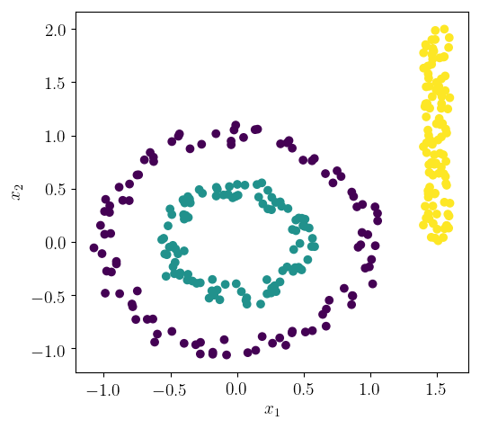

# HierarchicalClusterHs

HierarchicalClusterHs is a small Haskell program for clustering data based on hierarchical clusterization.



## Usage

HierarchicalClusterHs currently excepts data points to be given in a single-space-separated data file. For example,  `Test.txt`:

```
0.9832849 0.0684199
1.0394514 -0.0356402
0.9395337 0.0884182
...
```

To obtain 3 clusters you can run:

```sh
HiararchicalClusterHs Test.txt Result.txt 3
```

which creates a `Result.txt` file with the last column representing the cluster number of the corresponding data point:


```
-0.9567112 0.2772381 1
-0.9941113 0.2865241 1
-0.954816 0.3392383 1
...
```

The order of data points in the original file is not preserved.

If number of clusters is not supplied as a command line argument, then it is decided automatically.

```sh
HiararchicalClusterHs Test.txt Result.txt
```

## Library

Although HierarchicalClusterHs currently supports only numerical data and the Euclidean distance, the library that comes with it allows supplying other distance functions and other data types.

## Notes

If you supply HierarchicalClusterHs a data file with n data points, you can ask from 1 to n different clusters to be found. If you ask for 3 clusters, HiararchicalClusterHs starts with n clusters and at each stage it reduces the number of clusters as n-1, n-2, ... until 3. The number of clusters are reduced by joining the ones that are close to each other. The distance between two clusters is currently set as the minimum distance between data points from those clusters. This may result in undesired behavior in certain applications.